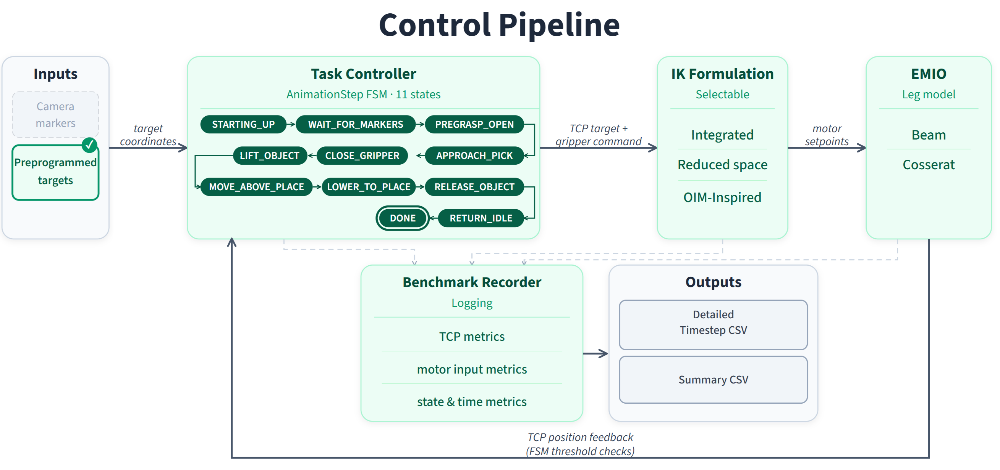

:::::: collapse General Camera-Driven Pick-and-Place with Evaluation
# General Camera-Driven Pick-and-Place with Evaluation

**To rund this lab, copy the "pick_and_place" folder into your local "emio-labs/v26.06.00-unstable/assets/labs/" folder.** You may have to update some file paths for it to run properly depending on your OS.

#runsofa-button("assets/labs/general_camera_driven_pickandplace_with_evaluation/general_camera_driven_pickandplace_with_evaluation.py")

This lab provides a complete pick-and-place pipeline for the EMIO soft robot, implemented as a SOFA program launched through the above button. It combines forward model / inverse solver selection, target acquisition, task execution, scene construction and benchmark logging and exporting in one streamlined environment, allowing efficient evaluation of different model/solver combination with minimal changes to the task environment. 

## Purpose

The lab is designed to answer one practical question: **How does EMIO perform on a high-precision pick-and-place when the forward kinematic model or inverse-solver formulation changes?**

To make that comparison meaningful, the lab keeps the task itself fixed:
- One robot configuration
- One target-acquisition interface
- One pick-and-place state machine

By changing only the selected forward model and inverse solver between runs, you can directly compare task completion, tracking quality, effort, and timing without rewriting the scene for each experiment.

---

## 1. System Architecture

The pick-and-place program is implemented as a finite state machine (FSM), with the core functionality shown in Figure 1.

*Figure 1: Finite state machine controlling the pick-and-place sequence.*

As shown in the figure, the finite state machine controls the pick-and-place sequence across eleven discrete states:

1. `STARTING_UP`: Initial state with a three-second warm-up period, allowing consecutive experiments to settle at the same location before starting.
2. `WAIT_FOR_MARKERS`: Blocking state intended for awaiting camera-detected marker positions. Quickly proceeds with preprogrammed positions if configured to.
3. `PREGRASP_OPEN`: End-effector moves until its internal TCP estimate is within a threshold of the x,z position of the pick target position.
4. `APPROACH_PICK`: The end-effector is lowered vertically until the TCP is within grasp height above the grasp position.
5. `CLOSE_GRIPPER`: Gripper legs actuate inward until the desired grip opening is estimated as achieved.
6. `LIFT_OBJECT`: The end-effector is raised vertically until the TCP is within a threshold of the desired transport height.
7. `MOVE_ABOVE_PLACE`: The end-effector is translated horizontally until the TCP is within a threshold of the x,z position of the place target position.
8. `LOWER_TO_PLACE`: The end-effector is lowered vertically until the TCP is within the release height above the place position.
9. `RELEASE_OBJECT`: Gripper legs actuate outward, returning to the open state.
10. `RETURN_IDLE`: The end-effector is translated until its TCP is within a threshold away from the home pose.
11. `DONE`: Terminal state where benchmark metrics are stored.

State transitions are triggered by predefined thresholds, tuned to achieve a balance between being strict enough for the end-effector to precisely produce the desired motion, yet loose enough to allow state transitions despite small model inaccuracies.

---

## 2. What the System Does (Execution Sequence)

To keep the system stable and interpretable for structured evaluation work, the lab relies on a few simplifying assumptions: the first tracked marker is the object, the second is the placement target, the grasp is virtual/proxy-driven, and the task is one-shot rather than continuous.

At runtime, the scene automatically performs the following sequence:
1.  **Build:** Constructs the EMIO robot with the selected leg model.
2.  **Configure:** Sets up the inverse-control stack for the selected solver.
3.  **Marker Proxy:** Creates visible proxy markers for the object, place target, task target, and Tool Center Point (TCP).
4.  **Acquisition:** Waits for camera markers or falls back to simulation markers.
5.  **Execution:** Progresses through the state machine.

### The State Machine
The core of the execution is driven by a rigid state machine. You will observe the system transition through these phases:
* `STARTING_UP` $\rightarrow$ `WAIT_FOR_MARKERS` $\rightarrow$ `PREGRASP_OPEN` $\rightarrow$ `APPROACH_PICK` $\rightarrow$ `CLOSE_GRIPPER` $\rightarrow$ `LIFT_OBJECT` $\rightarrow$ `MOVE_ABOVE_PLACE` $\rightarrow$ `LOWER_TO_PLACE` $\rightarrow$ `RELEASE_OBJECT` $\rightarrow$ `RETURN_IDLE` $\rightarrow$ `DONE`.

---

## 3. Data Recording and Benchmarking

The true value of this lab is observing the automated evaluation. Upon completion of a cycle, the system exports a benchmark summary. 

### 3.1 Automated Benchmark Outputs
Below is a real example of the automated `benchmark_summary.csv` generated by the EMIO system running the `beam_native` solver. This data gives you a precise look at the robot's mechanical effort, accuracy, and operational speed.

The system automatically generates a `benchmark_summary.csv` after each run. To include this data as a visual summary in your lab report, you should convert the key metrics into a clean image format.

*Figure 2: Automated performance metrics showing cycle time, motor effort, and state-by-state timing.*

**State-by-State Timing Breakdown:**
The benchmark also automatically tracks how long the robot spends in each phase of the task. For example:
- `state_starting_up_s`: 3.00 s
- `state_approach_pick_s`: 0.12 s
- `state_close_gripper_s`: 0.81 s
- `state_move_above_place_s`: 0.24 s

> **Lab Task:** Run the exact same sequence using a 3D Volumetric model. Compare the `integrated_abs_motor_input` and `cycle_time_s`. You will find that more complex physical models drastically affect calculation time and total effort!

### 3.2 Physical Efficacy and Success Rates
While the benchmark handles the internal states (motor effort, TCP error), you must also record the physical success of the grasp. This evaluates the real-world performance of the end-effector itself. 

*Figure 3: Summary of physical pick-and-place trials across different object geometries.*

When tabulating your own physical results, track the **Successful Picks**, **Successful Places**, and **Placement Error (mm)** across different object shapes (e.g., spheres, cylinders, cubes) as demonstrated in the table above. 

---

## 4. Discussion and Conclusion

This lab acts as a reusable evaluation harness. When analyzing your aggregated benchmark data, consider the following discussion points:

* **Tracking vs. Reality:** Look at the `mean_tcp_target_error_mm` from the automated benchmark. How did this value correlate with the physical *Max Placement Error* from your manual tables? 
* **Solver Impact:** Did changing the mathematical solver (e.g., to Quadratic Programming) decrease the cycle time? Did it affect the peak motor input?
* **The Soft Advantage:** Discuss how the compliance of the soft fingers allowed for a successful pick despite the presence of a TCP target error. In a rigid system, an error of ~21mm (as seen in the benchmark data) would almost certainly result in a crashed gripper or crushed object.

By bringing task setup, inverse-solver selection, target tracking, and live evaluation into a single scene, you can objectively quantify how different modeling choices affect the reality of soft robotic manipulation.
::::::
